TP4: Snort for IDS/IPS

Part 1: Snort as an IDS

1. Installing Snort

First, I downloaded and installed Snort on my Ubuntu system. The installation was successful as shown in the screenshot.

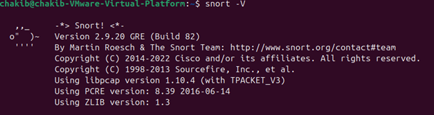

2. Viewing Network Configuration

I used the ifconfig command to view my network configuration to determine the interface and IP address details needed for Snort configuration.

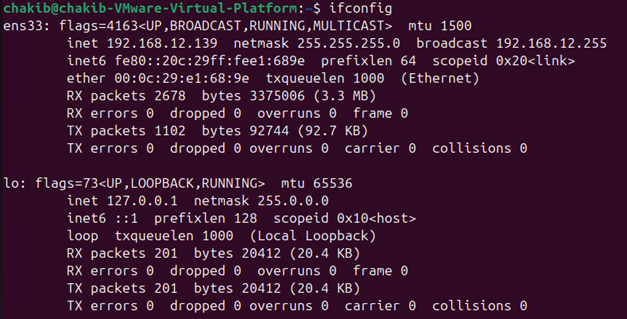

3. Configuring HOME_NET

I configured the HOME_NET value in the Snort configuration file to match my network:

Opened the snort.conf file using: sudo nano /etc/snort/snort.conf( ps :I don't have gedit and I prefer working with nano)
Modified the ipvar HOME_NET setting to match my subnet
Saved the configuration file

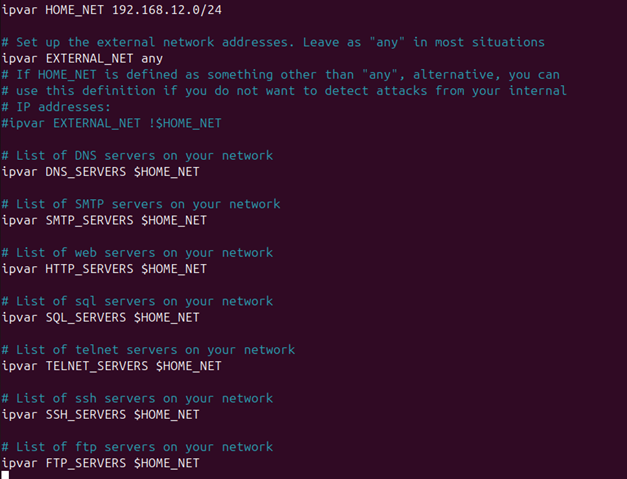

3.2. Verifying Configuration

I verified the Snort configuration was working properly by running:

sudo snort -T -i ens33 -c /etc/snort/snort.conf (ps: I was working with ubuntu desktop for ease of use so my interface was ens33).

The configuration test was successful.

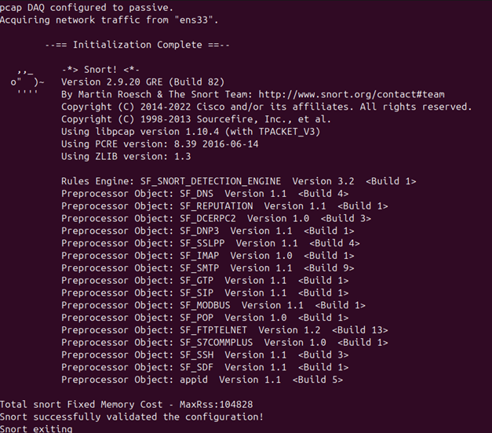

4. Creating Rules

Initial verification showed 0 Snort rules were loaded. I created my first rule in the local.rules file to detect ICMP traffic:

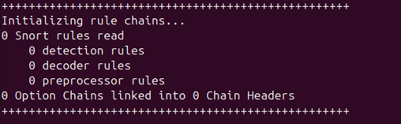

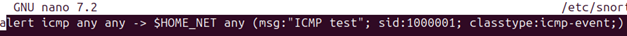

alert icmp any any -> $HOME_NET any (msg:"ICMP test"; sid:1000001; classtype:icmp-event;)

I ran the Snort configuration test again to verify that the rule was loaded successfully.

5. Running Snort in IDS Mode

I started Snort in IDS mode with console alerts:

sudo snort -A console -q -c /etc/snort/snort.conf -i ens33

6. Testing ICMP Detection

I pinged my Ubuntu system from the Kali Linux VM. When returning to the Snort console, I observed multiple alerts being generated for each ICMP packet, confirming that the rule was working correctly.

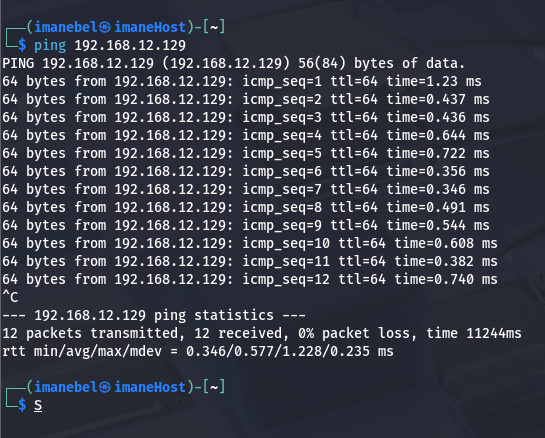

7. Creating an FTP Connection Rule

I created a second rule to detect FTP connection attempts from Kali Linux:

alert tcp 192.168.x.x any -> $HOME_NET 21 (msg:"FTP connection attempt"; sid:1000002; rev:1;)

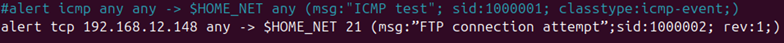

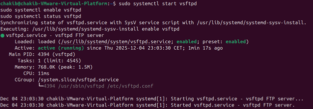

Running the ftp server for testing:

8. Running Snort with ASCII Logging

I ran Snort again with ASCII logging enabled:

sudo snort -A console -q -c /etc/snort/snort.conf -i ens33 -K ascii

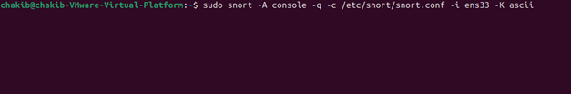

9. Testing FTP Connection Detection

From the Kali Linux VM, I initiated an FTP connection to my Ubuntu system. This triggered the FTP connection rule and generated alerts in the Snort console.

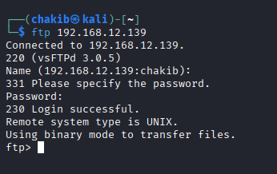

10. Verifying Alert Generation

The Snort console displayed alerts for the FTP connection attempts as expected, confirming that the rule was working correctly.(this is when trying from kali)

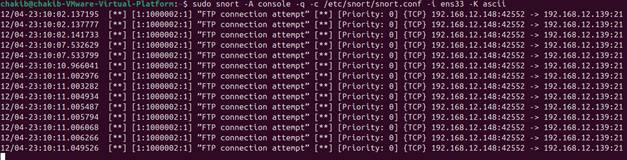

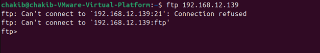

This is when trying from ubuntu for checking if there are no false positives :

11. Examining Snort Logs

I used the command ls /var/log/snort to view the Snort log directory, which contained log files including:

snort.log.\* files (pcap format)
IP address directories for alerts

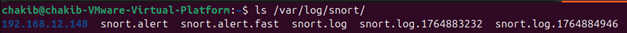

sudo ls /var/log/snort/192.168.12.148/

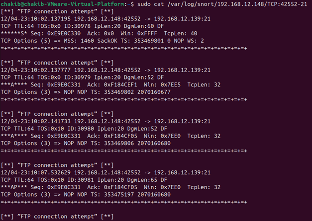

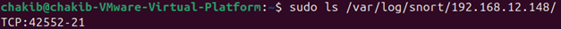

I examined the contents of the alert logs using:

11.2. Analyzing Packets with Wireshark

I used Wireshark to analyze the captured packets:

sudo wireshark

I opened ftp-capture.pcap file to examine the detailed packet information.(I copied it from the log because it didt open)

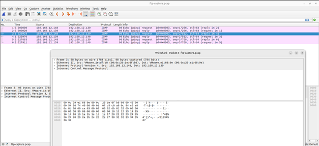

12-14. Testing with Windows Server

I verified the IP address of my Windows Server 2012 machine and connected to its FTP server using invalid credentials, which generated an "Login or password incorrect" message.

13. Finding the ip of the windows virtual machine:

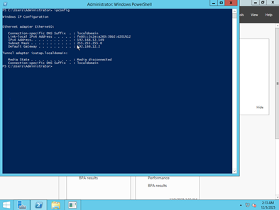

Trying to connect from ubuntu :

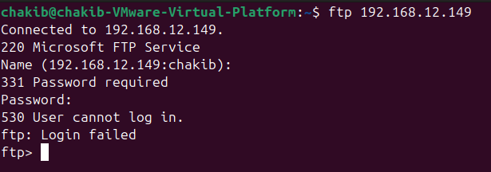

15. Creating a Failed Login Detection Rule

I created a third rule to detect failed FTP login attempts:

alert tcp $HOME_NET 21 -> any any (msg:"FTP failed login"; content:"Login or password incorrect"; sid:1000003; rev:1;)

16. Testing the Failed Login Rule

I tested the rule by attempting to connect to the FTP server with invalid credentials again. The rule successfully detected the failed login attempts and generated alerts in Snort.

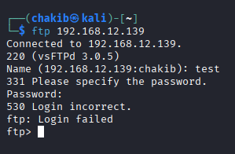

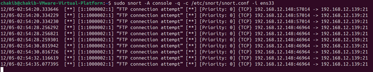

This completes Part 1 of the Snort IDS/IPS lab, demonstrating basic rule creation and alert detection for ICMP and FTP traffic.

Exo2:

1. Launching msploit and running the commands and setting the payloads and hosts :

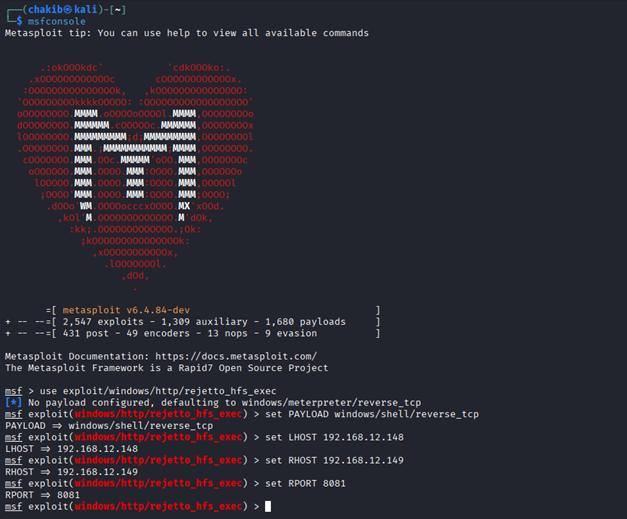

2. setting snort in logging mode to log every connection :

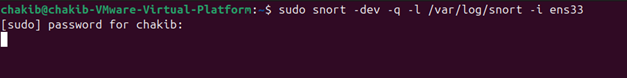

3.1 Running the HFS vulnerable server :

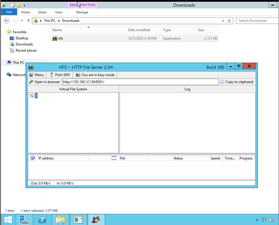

3.2: running the exploit now :

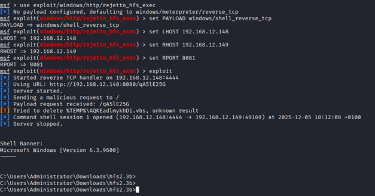

Snort captured all the traffic :

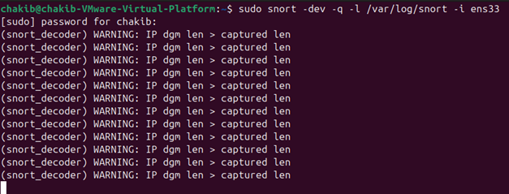

4. creating the account and running other commands :

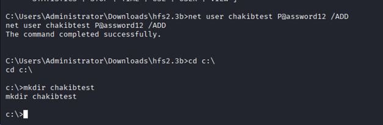

5.finding the packets :

6.following TCP streams :

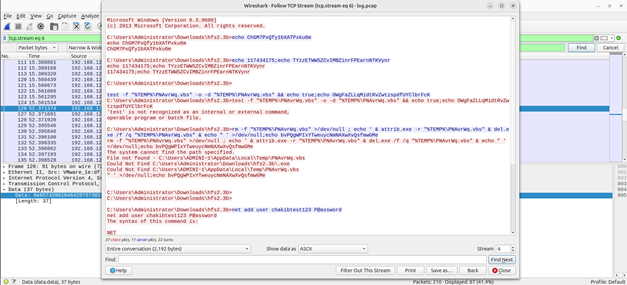

7.finding the wanted sring :

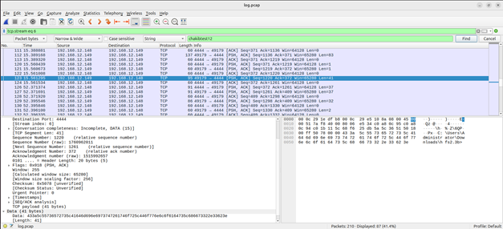

Exo 3 :

1. adding the new allert rule :

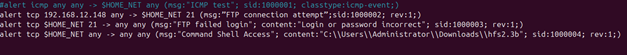

2. after rerunning snort with this new rule :

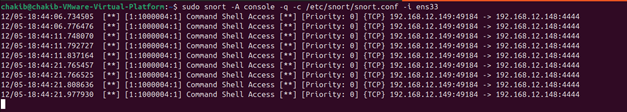

3. writing the new rule for the hex values :

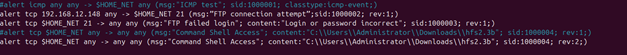

4. writing with the new hex dump :

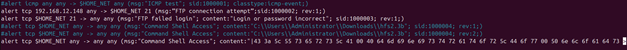

5. finding 2 alerts :

